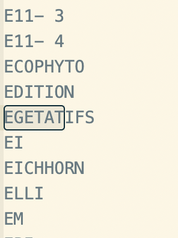

## Projection de la lexique

### Données :

 **Corpus de teste**
 
- [x] Viticulture 
- [ ] Maraichage
- [ ] GC

> Les données sont disponibles sur
> [https://gitlab.irstea.fr/copain/d2kab/-/tree/master/corpus_test/corpus_test_d2kab](url)

     

**Problèmes rencontrés :** 

- [x] Sauts de ligne

  

- [x] Différents apostrophes

  

- [x] Caractères unicode 
  
  
  

 
- [ ] Mots collés 
  * Type de police
 
      

      pdf : [http://ontology.inrae.fr/bsv/html/Corpus/Tests/Viticulture/pdf/BSV-viti-RA-15_09-07-2019_cle01ba24.pdf](url)
 
  * Sans raison particulière...

      
  
      pdf : [http://ontology.inrae.fr/bsv/html/Corpus/Tests/Viticulture/pdf/bsv_viti_lr_n03_16042019_cle82d51a.pdf](url)
  
- [ ] Mots séparés

  * Césures
  
      
      
      pdf : [http://ontology.inrae.fr/bsv/html/Corpus/Tests/Viticulture/pdf/alsace_vigne_no8_du_25-06-19_cle818164.pdf](url)
      
      
  * Types de police
  
      
      
      pdf : [http://ontology.inrae.fr/bsv/html/Corpus/Tests/Viticulture/pdf/BSV_4_-_7_mai_2019_cle8db5ca.pdf](url)
  
  
  * Lettres espacées 

### Vocabulaire :

**FCU**

_Stats :_

| BSV          | freq          |
|--|--|
| count         | 3722          |
| unique        | 77            |
| top           | cle01ba24     |

| prefLabel          | freq          |             
|--|--|     
| count         | 3722          |       
| unique        | 49            |       
| top           | vigne         |   

_freq by doc :_

_tf-idf :_

**Stades phénologiques**

