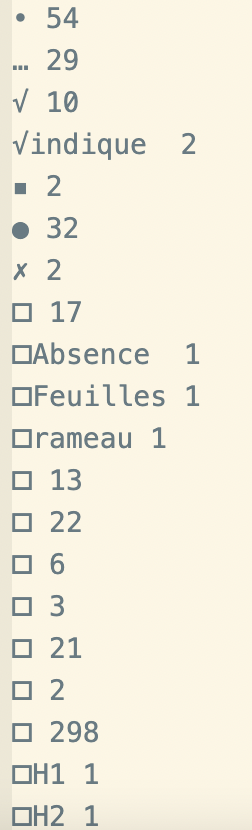

## Projection de la lexique

### Données :

 **Corpus de teste**
 
- [x] Viticulture
- [ ] Maraichage
- [ ] GC

> Les données sont disponibles sur
> [https://gitlab.irstea.fr/copain/d2kab/-/tree/master/corpus_test/corpus_test_d2kab](url)

     

**Problèmes rencontrés :** 

- [x] Sauts de ligne
- [x] Caractères unicode 

  
  
- [x] Différents apostrophes
- [ ] Mots collés 
- [ ] Mots séparés
  * Césures
  * Types de police
  * Lettres espacées 

### Vocabulaire :

**FCU**

Stats :

| prefLabel     | freq          | 
| ------------- |:-------------:| 
| count         | 3722          | 
| unique        | 49            | 
| top           | 1788          |  

tf-idf :

    

**Stades phénologiques**

